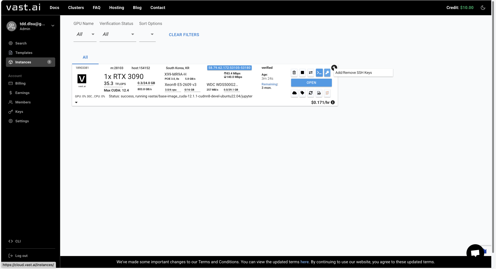
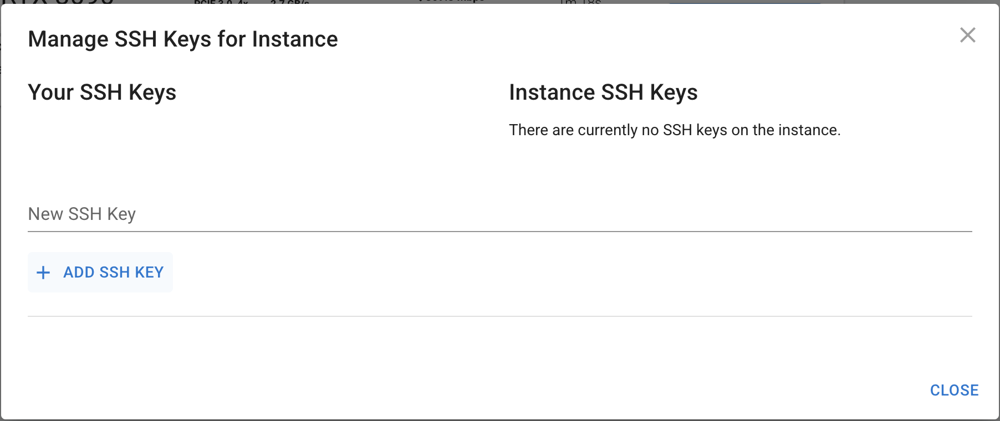
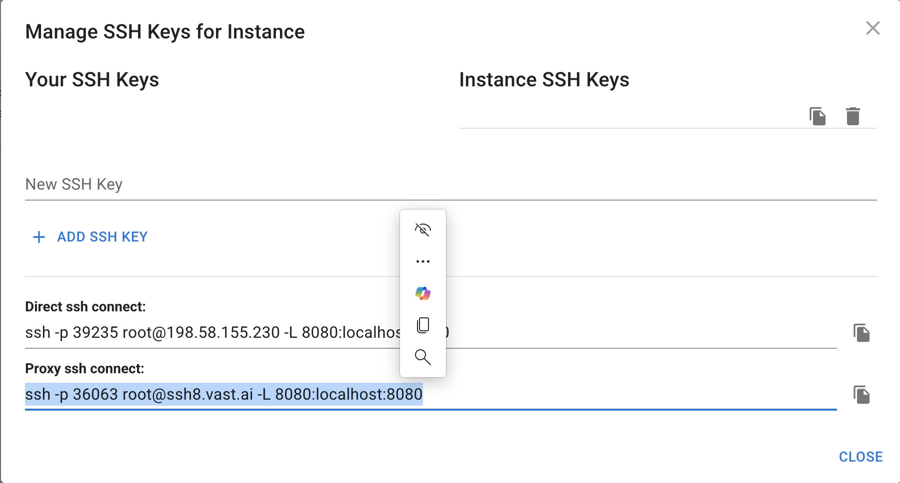

# **TDD Deployment**

This repository contains a Flask API for generating test cases using a Hugging Face model fine-tuned for Test-Driven Development (TDD). The API is designed to analyze code and suggest essential test cases.

---

## **Features**
- **Test Case Generation:** Generates test cases based on input code or descriptions.
- **GPU Acceleration:** Uses PyTorch and Hugging Face Transformers for fast inference.
- **Production-Ready:** Deployed with `gunicorn` and `torchrun` for scalability.

---

## **Setup**

### **1. Clone the Repository**
Clone this repository:
```bash
git clone https://github.com/RichterDelaCruz/tdd-deployment.git
cd tdd-deployment
```

---

## **Running on Local Machine (CPU)**

### **1. Install Dependencies**
Install the required Python packages:
```bash
pip install -r requirements.txt
```

### **2. Run the Application**
Start the Flask API:
```bash
python generate-test.py
```

### **3. Test the API**
Send a request using `curl`:
```bash
curl -X POST "http://localhost:8000/generate" \
  -H "Content-Type: application/json" \
  -d '{"input_text": "Write a Python function to add two numbers"}'
```

---

## **Running on Remote GPU (Vast.ai)**

### **1. Set Up Remote GPU Instance**
- Use the following template on Vast.ai:
  - **GPU:** NVIDIA A100 80GB
  - **Disk Space:** At least 20GB (to accommodate the model and dependencies).
  - **CUDA:** Ensure the instance supports CUDA for GPU acceleration.

### **2. Generate and Add SSH Key**

#### **Generate a New SSH Key**
1. Run the following command to generate a new SSH key:
   ```bash
   ssh-keygen -t ed25519 -C "your_email@example.com"
   ```
   - Press **Enter** to accept the default file location (`~/.ssh/id_ed25519`).
   - Optionally, set a passphrase for added security (or leave it blank).

2. Copy the public key:
   ```bash
   cat ~/.ssh/id_ed25519.pub
   ```

#### **Add SSH Key to Vast.ai**
1. Go to your Vast.ai dashboard.
2. Click the **Add/Remove SSH Keys** button (it looks like a key icon).
   
   
3. Paste your public key into the text box and click **Save**.

---

### **3. Connect to Your Remote Instance**

#### **Copy the Proxy SSH Command**
1. In your Vast.ai dashboard, locate the **Proxy SSH Command**.
2. Click the **Copy Proxy SSH Command** button.
   

#### **Run the SSH Command**
Paste the copied command into your terminal. It will look something like this:
```bash
ssh -p 25855 -L 8000:localhost:8000 root@ssh5.vast.ai
```
- `-p 25855`: The custom port for your instance.
- `-L 8000:localhost:8000`: Forwards port 8000 from the remote instance to your local machine.
- `root@ssh5.vast.ai`: The username and hostname for your instance.

---

### **4. Set Up the Remote Instance**

#### **Clone the Repository**
Clone the repository on the remote instance:
```bash
git clone https://github.com/RichterDelaCruz/tdd-deployment.git
cd tdd-deployment
```

#### **Install Dependencies**
Install the required Python packages:
```bash
pip install -r requirements.txt
```

#### **Start the Flask API**
Run the Flask API on the remote instance:
```bash
torchrun --nproc_per_node=1 gunicorn -w 1 -b 0.0.0.0:8000 generate-test:app
```

---

### **5. Test the API**

#### **From Your Local Machine**
Send a request from your local machine:
```bash
curl -X POST "http://localhost:8000/generate" \
  -H "Content-Type: application/json" \
  -d '{"input_text": "Write a Python function to add two numbers"}'
```

#### **From the Remote Instance**
Send a request directly from the remote instance:
```bash
curl -X POST "http://localhost:8000/generate" \
  -H "Content-Type: application/json" \
  -d '{"input_text": "Write a Python function to add two numbers"}'
```

---

## **Testing**

### **1. Example Input**
Use the `prompt.json` file to test the API:
```bash
curl -X POST "http://localhost:8000/generate" \
  -H "Content-Type: application/json" \
  --data-binary @prompt.json
```

### **2. Example Output**
The API will return a response like:
```json
{
  "result": "Test Case: Verify that the `hash_function` in `helpers.py` correctly hashes a password using SHA-256.\nReason: This ensures that passwords are securely hashed and cannot be easily reversed.\nInput: `password123`\nExpected Output: A SHA-256 hash of the input password, e.g., `ef92b778bafe771e89245b89ecbc08a44a4e166c06659911881f383d4473e94f`."
}
```

---

## **Files**
- `generate-test.py`: The Flask app for generating test cases.
- `requirements.txt`: List of Python dependencies.
- `prompt.json`: Example input for testing the API.
- `README.md`: This file.

---

## **License**
This project is licensed under the MIT License. See the [LICENSE](LICENSE) file for details.

---

### **One-Liner for Quick Setup on Vast.ai**
If you want to automate everything from scratch on a fresh Vast.ai instance, use this **one-liner**:
```bash
bash <(curl -s https://raw.githubusercontent.com/RichterDelaCruz/tdd-deployment/main/run_app.sh)
```

---

### **Troubleshooting**

#### **Permission Denied (publickey)**
- Ensure your public key was added to Vast.ai **exactly** as shown by `cat ~/.ssh/id_ed25519.pub`.
- Verify you’re using the correct private key with the `-i` flag:
  ```bash
  ssh -p 25855 -i ~/.ssh/id_ed25519 root@ssh5.vast.ai
  ```

#### **Driver/Library Version Mismatch**
If you see the error `Failed to initialize NVML: Driver/library version mismatch`, update your NVIDIA driver:
```bash
sudo apt update
sudo apt install -y nvidia-driver-525  # Replace 525 with the required version
sudo reboot
```

